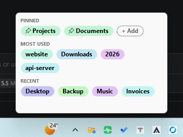

# Recent Folders

A small Windows 11 tray app. Put the mouse on its tray icon, and a small window shows
the folders you use in File Explorer as colored badges. Click a badge to open the folder.



- **Pinned** – folders you keep forever.
- **Most used** – folders you use most often.
- **Recent** – folders you used last.

## How it finds "used" folders

Every 5 seconds the app checks which folders are open in File Explorer (all windows and tabs).
A folder counts as **used** only when it stays open for **30 seconds**.
So folders you only pass through on the way to another folder are not saved.

The check uses very little CPU:

- When no File Explorer window is open, it only does one very cheap window lookup.
- It runs on a low-priority background thread.
- You can change both numbers in the settings file (`pollIntervalSeconds`, `dwellSeconds`).

## Download and start

Download a zip from the [Releases](https://github.com/fatehiman/recent-folders/releases) page:

| File | Size | Needs |
|---|---|---|
| `recent-folders-<ver>-win-x64.zip` | small | [.NET 8 Desktop Runtime](https://dotnet.microsoft.com/download/dotnet/8.0) (x64) |
| `recent-folders-<ver>-win-x64-standalone.zip` | bigger | nothing |
| `recent-folders-<ver>-win-arm64-standalone.zip` | bigger | nothing (ARM PCs) |

1. Unzip it into a folder you can write to (for example `C:\Tools\recent-folders`).
2. Start `recent-folders.exe`. The icon appears in the tray.
3. Windows 11 often puts new icons in the hidden icons area (`^`).
   To keep the icon on the taskbar, drag it from `^` to the taskbar, or turn it on in
   **Settings › Personalization › Taskbar › Other system tray icons**.
4. Optional: right-click the icon › **Start with Windows**.

Only one copy runs at a time. If you start the exe again, the window of the running copy opens.

## Using it

**Tray icon**

| Action | Result |
|---|---|
| Mouse on the icon | The window opens (fades in). It closes when the mouse leaves. |
| Left click | The window opens and stays open until you click somewhere else. |
| Right click | Menu (see below). |

**Tray menu**

| Item | What it does |
|---|---|
| Open | Opens the window. Use this when "Open on mouse over" is off. |
| Open on mouse over | On (checked) = window opens on mouse over. Off = use left click or **Open**. The app remembers this. |
| Add folder... | Choose a folder to pin. |
| Clear history... | Removes all folders that are not pinned. |
| Settings... | Opens the settings file in Notepad. |
| Start with Windows | Starts the app when you sign in. |
| Exit | Closes the app. |

**In the window**

- Click a badge: open the folder.
- Right-click a badge: **Open**, **Pin / Unpin**, **Copy path**, **Remove from list**.
- **+ Add** badge: choose a folder to pin.
- Drag a folder from File Explorer into the window: the folder is pinned.
- Mouse wheel: scroll when there are many folders.
- Mouse on a badge: shows the full path.
- `Esc`: close the window.

Badge colors come from the folder name. The same name always gets the same light color.
The text is bold and black, so it is easy to read.

## Settings

The settings file is next to the exe, with the same name and the `.conf` extension:
`recent-folders.exe` → `recent-folders.conf`.
The format is JSON. Lines that start with `//` are comments.
If the file does not exist, the app creates it with all options and examples
(the examples are commented-out lines). Changes are used the next time the window opens.

The full file with all options is [src/default.conf](src/default.conf). A short summary:

| Setting | Default | Meaning |
|---|---|---|
| `window.width`, `window.height` | `300`, `200` | Window size in pixels (at 100% display scale). |
| `window.backgroundColor` | `#F9F9F9` | Window background. |
| `window.opacity` | `1.0` | `0.3` … `1.0`. |
| `window.corners` | `round` | `round`, `small`, `square`. |
| `window.borderColor` | `""` | `""` = Windows default, `none`, or a color. |
| `window.padding`, `window.gap` | `10`, `8` | Inner space; space between the taskbar and the window. |
| `window.showSectionTitles` | `true` | Show PINNED / MOST USED / RECENT. |
| `fade.enabled`, `fadeInMs`, `fadeOutMs` | `true`, `150`, `200` | Fade effect. |
| `mouseOver.openOnMouseOver` | `true` | Start value of the tray menu item. |
| `mouseOver.showDelayMs`, `hideDelayMs` | `250`, `400` | Wait times before open / close. |
| `font.family`, `font.size`, `font.titleSize` | `Segoe UI`, `9`, `7.5` | Font (sizes in points). |
| `badge.style` | `pill` | `pill`, `rounded`, `square`, `outline`, `raised`, `compact`, or your own style. |
| `badge.textColor`, `badge.bold` | `#000000`, `true` | Badge text. |
| `badge.saturation`, `badge.lightness` | `0.70`, `0.86` | Badge colors. Lightness is kept between `0.70` and `0.97`. |
| `badge.spacing`, `maxTextWidth` | `6`, `150` | Space between badges; long names are cut with "…". |
| `badge.showPinIcon`, `showAddButton` | `true`, `true` | Pin symbol; "+ Add" button. |
| `customStyles` | `[]` | Your own badge styles (corner radius, padding, border, shadow, gradient). |
| `sections` | `["pinned","frequent","recent"]` | Which sections to show, and their order. |
| `tracking.pollIntervalSeconds` | `5` | How often Explorer is checked. |
| `tracking.dwellSeconds` | `30` | How long a folder must stay open to count. |
| `tracking.maxRecent`, `maxFrequent` | `12`, `8` | Number of badges per section. |
| `tracking.minUsesForFrequent` | `2` | Uses needed for "Most used". |
| `tracking.showDuplicates` | `false` | `false` = each folder is shown only once. |
| `tracking.maxHistory` | `300` | Not-pinned folders to remember. |
| `tracking.excludePaths` | `[]` | Folders never tracked, with `*` and `?` wildcards. |
| `dataFile` | `""` | Where your folders are saved (see below). |

### Where your folders are saved

In `recent-folders.data.json` next to the exe. If that folder is read-only
(for example under `C:\Program Files`), the app uses
`%LOCALAPPDATA%\recent-folders\recent-folders.data.json`.
You can set your own path with `dataFile`.

## Build from source

Needs the [.NET 8 SDK](https://dotnet.microsoft.com/download/dotnet/8.0) on Windows.

```powershell
dotnet run --project src            # run
.\build.ps1                          # make release zips in .\dist
```

### Project layout

| File | Purpose |
|---|---|
| `src/Program.cs` | Start point, single copy check. |
| `src/TrayApp.cs` | Connects everything: tray icon, menus, window position, actions. |
| `src/TrayIcon.cs` | Tray icon with `Shell_NotifyIcon` (needed to get the icon position). |
| `src/PopupForm.cs` | Borderless window, fade in/out, close on mouse leave. |
| `src/BadgePanel.cs` | Draws the sections and badges; mouse, scroll, drag and drop. |
| `src/ExplorerWatcher.cs` | Checks open File Explorer folders (Shell.Application COM). |
| `src/FolderStore.cs` | Pinned / recent / most used list, saved as JSON. |
| `src/AppConfig.cs` | Reads the `.conf` file. |
| `src/BadgeStyles.cs` | Built-in badge styles. |
| `src/default.conf` | Default settings file with all options and examples. |

## License

[MIT](LICENSE)
